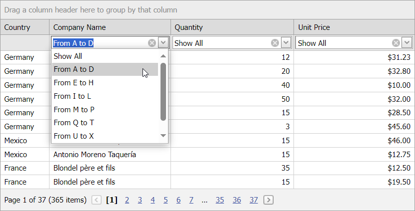

<!-- default badges list -->

<!-- default badges end -->
# Grid View for ASP.NET Web Forms - How to apply custom filter criteria
<!-- run online -->
**[[Run Online]](https://codecentral.devexpress.com/128537118/)**
<!-- run online end -->
This example demonstrates how to allow users to set custom filter criteria in the Grid View control's filter row.

Handle the [AutoFilterCellEditorCreate](https://docs.devexpress.com/AspNet/DevExpress.Web.ASPxGridView.AutoFilterCellEditorCreate?p=netframework) event to display custom editors in filter row cells. The [AutoFilterCellEditorInitialize](https://docs.devexpress.com/AspNet/DevExpress.Web.ASPxGridView.AutoFilterCellEditorInitialize?p=netframework) event occurs before the filter row appears and allows you to initialize editors in filter row cells. The [ProcessColumnAutoFilter](https://docs.devexpress.com/AspNet/DevExpress.Web.ASPxGridView.ProcessColumnAutoFilter?p=netframework) event allows you to apply custom filter criteria when a user changes an editor value in the filter row.

## Files to Review

* [Default.aspx](./CS/WebSite/Default.aspx) (VB: [Default.aspx](./VB/WebSite/Default.aspx))
* [Default.aspx.cs](./CS/WebSite/Default.aspx.cs) (VB: [Default.aspx.vb](./VB/WebSite/Default.aspx.vb))

## Documentation

- [Filter Row](https://docs.devexpress.com/AspNet/3753/components/grid-view/concepts/filter-data/filter-row)

## More Examples

- [How to implement a filter row template and use ASPxGridLookup as an editor](https://github.com/DevExpress-Examples/asp-net-web-forms-grid-implement-filter-row-template)
